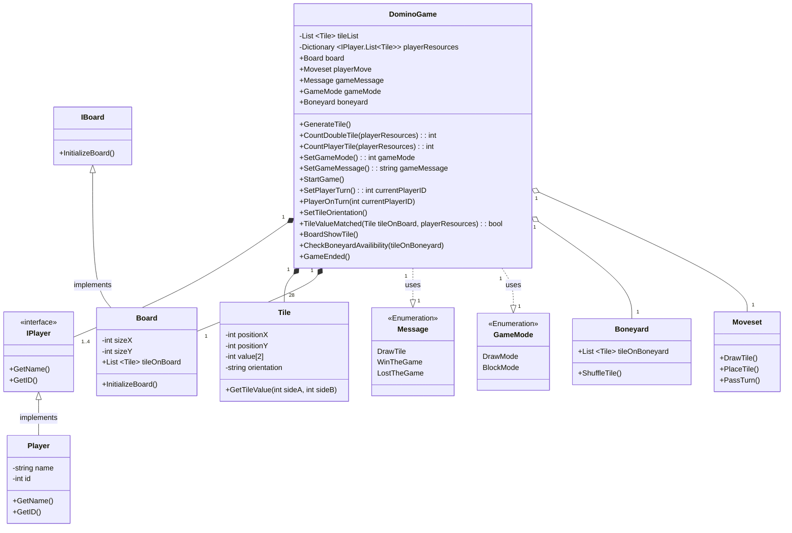

```mermaid
classDiagram
    %%Game runner 
    DominoGame "1" *-- "1..4" IPlayer
    DominoGame "1" *-- "28" Tile
    DominoGame "1"*--"1" Board
    DominoGame "1"..|>"1" Message : uses
    DominoGame "1"..|>"1" GameMode : uses
    DominoGame "1"o--"1" Boneyard
    DominoGame "1"o--"1" Moveset

    %%Player
    IPlayer <|-- Player : implements

    %%Board
    IBoard <|-- Board : implements

    class DominoGame{
        -List ~Tile~ tileList
        -Dictionary ~IPlayer.List~Tile~~ playerResources
        %%+IPlayer playerTurn > is this necessary?
        +Board board
        +Moveset playerMove
        +Message gameMessage
        +GameMode gameMode
        +Boneyard boneyard
        +GenerateTile()
        +CountDoubleTile(playerResources) : int
        +CountPlayerTile(playerResources) : int
        +SetGameMode() : int gameMode
        +SetGameMessage() : string gameMessage
        +StartGame()
        +SetPlayerTurn() : int currentPlayerID
        +PlayerOnTurn(int currentPlayerID)
        +SetTileOrientation()
        +TileValueMatched(Tile tileOnBoard, playerResources) : bool
        +BoardShowTile()
        +CheckBoneyardAvailibility(tileOnBoneyard)
        +GameEnded()
    }
    class Player{
        -string name
        -int id
        +GetName()
        +GetID() 
    }
    class IPlayer{
        <<interface>>
        +GetName()
        +GetID()
    }
    class Tile{
        -int positionX
        -int positionY
        -int value[2]
        -string orientation
        +GetTileValue(int sideA, int sideB)
    }
    class Boneyard{
        +ShuffleTile()
        +List ~Tile~ tileOnBoneyard
    }
    class Board{
        -int sizeX
        -int sizeY
        +List ~Tile~ tileOnBoard
        +InitializeBoard()
    }
    class IBoard{
        +InitializeBoard()
    }
    class Moveset{
        +DrawTile()
        +PlaceTile()
        +PassTurn()
    }
    class Message{
        <<Enumeration>>
        DrawTile
        WinTheGame
        LostTheGame
    }
    class GameMode{
        <<Enumeration>>
        DrawMode
        BlockMode
    }
```